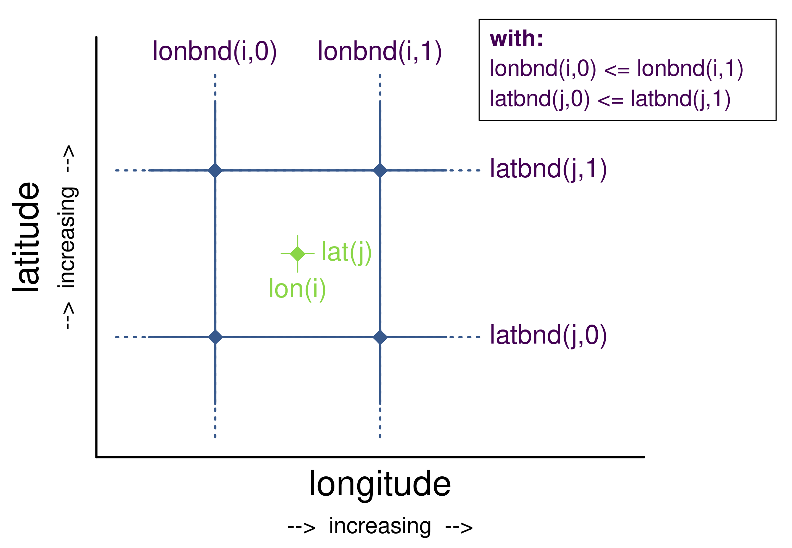
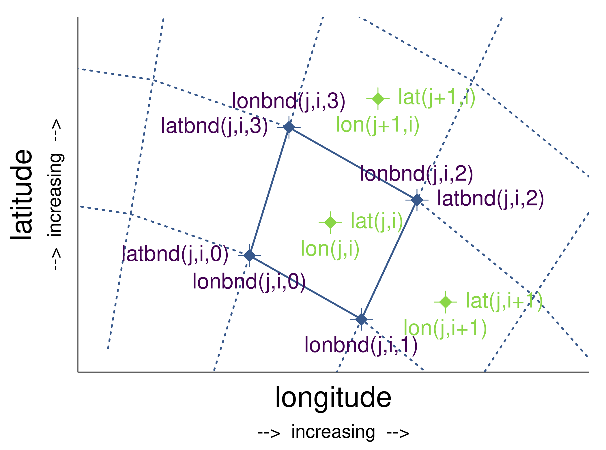

# Purpose

I suggested to add a few figures to the CF-Conventions' section [7.1 Cell Boundaries](http://cfconventions.org/Data/cf-conventions/cf-conventions-1.7/cf-conventions.html#cell-boundaries) explaning the order of `bnds` coordinates graphically. This repository holds R scripts to create such graphics. The discussion on the figures takes/took place in issues [#193](https://github.com/cf-convention/cf-conventions/issues/193) of the CF-Conventions GitHub repository.

# Types of graphics

## 1D case

Text CF-Coventions:

> Bounds for 1-D coordinate variables  
>   
> For a coordinate variable such as lat(lat) with associated boundary variable latbnd(x,2), the interval endpoints must be ordered consistently with the associated coordinate, e.g., for an increasing coordinate, lat(1) > lat(0) implies latbnd(i,1) >= latbnd(i,0) for all i  
>   
> If adjacent intervals are contiguous, the shared endpoint must be represented indentically in each instance where it occurs in the boundary variable. For example, if the intervals that contain grid points lat(i) and lat(i+1) are contiguous, then latbnd(i+1,0) = latbnd(i,1).  

We have the scripts

* `case_1D_a.R`
* `case_1D_b.R`
* `order_horizontal_bounds__1D_coord_variables.R` (final)

This is the plot for case 1Db:

 (final)

## 2D case

Text CF-Coventions:

> Bounds for 2-D coordinate variables with 4-sided cells  
>   
> In the case where the horizontal grid is described by two-dimensional auxiliary coordinate variables in latitude lat(n,m) and longitude lon(n,m), and the associated cells are four-sided, then the boundary variables are given in the form latbnd(n,m,4) and lonbnd(n,m,4), where the trailing index runs over the four vertices of the cells. Let us call the side of cell (j,i) facing cell (j,i-1) the "i-1" side, the side facing cell (j,i+1) the "i+1" side, and similarly for "j-1" and "j+1". Then we can refer to the vertex formed by sides i-1 and j-1 as (j-1,i-1). With this notation, the four vertices are indexed as follows: 0=(j-1,i-1), 1=(j-1,i+1), 2=(j+1,i+1), 3=(j+1,i-1).  
>   
> If i-j-upward is a right-handed coordinate system (like lon-lat-upward), this ordering means the vertices will be traversed anticlockwise on the lon-lat surface seen from above. If i-j-upward is left-handed, they will be traversed clockwise on the lon-lat surface.  
>   
> The bounds can be used to decide whether cells are contiguous via the following relationships. In these equations the variable bnd is used generically to represent either the latitude or longitude boundary variable.

We have the scripts

* `case_2D_a.R`
* `case_2D_b.R`
* `case_2D_c.R`
* `order_horizontal_bounds__2D_coord_variables.R` (final)

This is the plot for case 2Db:

 (final)

## 3D case

Text CF-Coventions:

> Bounds for multi-dimensional coordinate variables with p-sided cells  
>   
> In all other cases, the bounds should be dimensioned (...,n,p), where (...,n) are the dimensions of the auxiliary coordinate variables, and p the number of vertices of the cells. The vertices must be traversed anticlockwise in the lon-lat plane as viewed from above. The starting vertex is not specified.  
>   
> For rectangular grids, two-dimensional cells can be expressed as Cartesian products of one-dimensional cells of the type in the preceding example. However for non-rectangular grids a "rectangular" cell will in general require specifying all four vertices for each cell.

To be done in future?!
