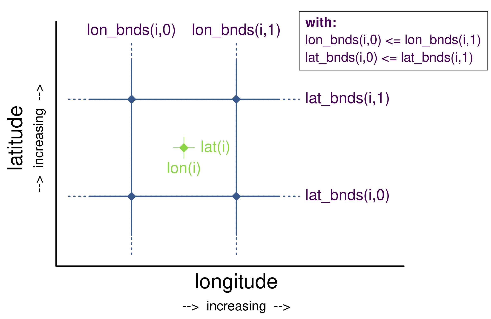

# Purpose

I suggested to add a few figures to the CF-Conventions' section [7.1 Cell Boundaries](http://cfconventions.org/Data/cf-conventions/cf-conventions-1.7/cf-conventions.html#cell-boundaries) explaning the order of `bnds` coordinates graphically. This repository holds R scripts to create such graphics. The discussion on the figures takes/took place in issues [#193](https://github.com/cf-convention/cf-conventions/issues/193) of the CF-Conventions GitHub repository.

# Types of graphics

## 1D case

Text CF-Coventions:

> Bounds for 1-D coordinate variables
> 
> For a coordinate variable such as lat(lat) with associated boundary variable latbnd(x,2), the interval endpoints must be ordered consistently with the associated coordinate, e.g., for an increasing coordinate, lat(1) > lat(0) implies latbnd(i,1) >= latbnd(i,0) for all i
> 
> If adjacent intervals are contiguous, the shared endpoint must be represented indentically in each instance where it occurs in the boundary variable. For example, if the intervals that contain grid points lat(i) and lat(i+1) are contiguous, then latbnd(i+1,0) = latbnd(i,1).

We have the scripts

* case_1D_a.R
* case_1D_b.R

This is the plot for case 1Db:

## 2D case

We have the scripts

* case_2D_a.R
* case_2D_b.R
* case_2D_c.R

This is the plot for case 2Db:

## 3D case

TODO or not TODO?

